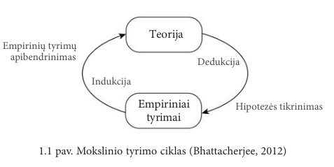

# Egzaminui „Mokslinių tyrimų ir inovacijų pagrindai“

## Mokslinis tyrimas

### Mokslinio tyrimo apibrėžimai

Tai tyrimas, atliekamas sisteminiais ir apgalvotais moksliniais metodais duomenims gauti, analizuoti ir aiškinti.

### Mokslinio tyrimo tikslas

Mokslinio tyrimo metu siekiama prisidėti prie mokslo sistemingai kuriant mokslo žinias apie tam tikrus realaus pasaulio reiškinius arba objektus.

### Apibrėžti mokslinio tyrimo teorinį ir empirinį lygmenis

* **Teorinis lygmuo** - siekiama plėtoti abstrakčias sąvokas apie pasirinktą reiškinį, šių sąvokų ryšius (t. y. kurti teorijas)
* **Empirinis lygmuo** - siekiama išbandyti teorines sąvokas ir ryšius, siekiant įsitikinti, ar jie atspindi stebėjimus tikrovėje. 

### Apibrėžti mokslinio tyrimo formą – indukciją

Tai samprotavimo procesas, apimantis perėjimą nuo specifinio prie bendrojo. 

Indukcinio tyrimo metu, tyrėjo tikslas yra iš stebėtų duomenų išvesti sąvokas ir modelius.

### Apibrėžti mokslinio tyrimo formą – dedukciją

Tai samprotavimo procesas, apimantis perėjimą nuo bendrojo prie specifinio.

Dedukcinio tyrimo metu, tyrėjo tikslas yra išbandyti savokas ir modelius, žinomus teorijoje.

### Kas yra mokslinės žinios?

Dėsnių ir teorijų apibendrinta visuma, įgyjama taikant mokslinį metodą, siekiant paaiškinti dominantį reiškinį arba elgesį.

### Mokslinio tyrimo ciklas

### Išvardyti mokslinių žinių išgavimo būdus ir mokėti trumpai juos paaiškinti

* Intuicija
  * Veiksmas arba procesas, nukreiptas į žinias ar tikrumą be samprotavimų arba išvadų darymo;
  * Paremta pateisinimais kaip "man atrodo teisinga", "aš tikiu"; 
  * Nėra mechanizmo atskirti tikslias ir netikslias žinias.
* Autoritetas
  * Kito asmens informacijos ar faktų priėmimas, nes asmuo yra gerbiamas šaltinis;
  * Asmens pateikiama informacija ar žinios gali būti netikslūs;
  * Naudojama norint įvertinti, ar keliama hipotezė yra patikrinama ir ar nagrinėjamas svarbus klausimas. 
* Racionalizmas
  * Žinios gaunamos naudojant samprotavimus ir daroma prielaida, jog pagrįstos žinios yra įgyjamos naudojant teisingą samprotavimo procesą;
  * Didžiausias racionalizmo trūkumų - du sąžiningi asmenys gali padaryti skirtingas išvadas;
  * Moksle samprotavimas naudojamas keliant hipotezes ar nustatant rezultatus, kurie parodytų hipotezių teisingumą ar klaidingumą.
* Empirizmas
  * Žinių įgyjimo būdas per patirtį;
  * Naudojant ***tik*** empirizmą, kyla pavojus - laikui bėgant gali pasikeisti požiūris į patirtį, įvykių atmintis nėra pastovi, žmonės pamištra, arba jų atsiminimai išsikraipo;
  * Norint naudoti empirizmą, tyrimai ir jų stebėjimai turi būti atliekami kontroliuojamomis sąlygomis, bandant sumažinti tyrėjų šališkumą ir padidinti objektyvumą.

## Inovacijos ir jas apibrėžiantys dokumentai

### Inovacijos apibrėžimas;

Naujas arba patobulintas produktas ar procesas (ar jų derinys), kuris itin skiriasi nuo ankstesnių produktų ar procesų ir kuris yra prieinamas potencialiems naudotojams arba kuris yra naudojamas.

### Kas yra Fraskati vadovas, kas jame pateikiama?

Ekonominio bendradarbiavimo ir plėtros organizacijos (EBPO) ir nacionaliniais mokslinių tyrimų ir eksperimentinės plėtros (MTEP) ekspertų parengtas dokumentas - oficialusis standartinės praktikos mokslinių tyrimų ir eksperimentinės plėtros statistiniams tyrimams atlikti vadovas.

Vadove pateikti tarptautiniu mastu pripažinti MTEP apibrėžimai ir jų komponentų veiklos klasifikacijos.

### Kas yra Oslo vadovas, kas jame pateikiama?

Tai yra tarptautinis informacinis standartas, skirtas inovacijoms konceptualizuoti ir matuoti.

Jame pateikiamos mokslinės, technologinės ir inovacinės veiklos matavimo, duomenų apie inovacijas rinkitmo ir naudojimo gairės.

### Apibrėžti inovacijų rūšis: produktų ir verslo procesų inovacijas;

### Kas yra MTEP ir jo apibrėžimas

Kūrybiškas ir sistemingas darbas, atliekamas plėsti turimas žinias, taip pat žinias apie žmoniją, kultūrą ir visuomenę, ir rasti naujų tokių žinių pritaikymo būdų.

### Kokias veiklos rūšis apima MTEP?

* Fundamentiniai tyrimai
  * Taikomoji/teorinė veikla vykdoma siekiant įgyti naujų žinių apie reiškinio esmę ir stebimus faktus;
  * pvz.: bendrųjų algoritmų, naudojamų dideliam duomenų kiekiui tvarkyti realiuoju laiku, savybių tyrimai.
* Taikomieji tyrimai
  * Originalus tyrimas atliekamas naujoms žinioms įgyti, nukreiptas į specifinių praktinių pasiekimą ar uždavinių įgyvendinimą.
  * pvz.: tyrimas, kuriuo siekiama rasti būdų mažinti brukalų (spam) srautą ir suprasti bendrą brukalų struktūrą ar verslo modelį, juos siunčiančių asmenų funkcijas ir motyvus.
* Eksperimentinė plėtra
  * Mokslinių tyrimų ir praktinės patirties pagrindu sukauptu pažinimu pagrįsta sisteminga veiklas, leidžianti įgyti papildomų žinių, tiesiogiai prisidenčių kuriant naujus produktus ar procesus, ar juos tobulinant;
  * pvz.: startuolis pasinaudoja tyrėjų sukurtu kodu ir parengia verslo planą, pritaikytą programų sistemos produktui, užtikrinančiam geresnę internetinę rinkodarą.

## Mokslinių tyrimų tipai ir tyrimo metodai;
### Žinoti kuriai mokslo sričiai ir krypčiai priklauso jūsų studijų programa;
### Apibrėžti ką reiškia pasakymas – mokslinis tyrimas pagrįstas metodologiškai;
### Mokslinių tyrimų klasifikavimas pagal: taikomus metodus, tyrimo metodiką, keliamus tikslus, organizavimo tipą.
### Kas yra trianguliacija? Kokie galimi trianguliacijos būdai?
### Kuo skiriasi teoriniai ir empiriniai darbai?
### Kas yra teorija? Kas yra empirija?
### Dedukcinių metodų veikimo principas;
### Indukcinių metodų veikimo principas;
### Kas yra eksperimentas? Išvardykite eksperimentinio tyrimo etapus;
### Kas yra hipotezė?
### Eksperimento kintamieji ir grupės;
### Eksperimentinių tyrimų rūšys: preliminarieji, skerspjūvio, longitudiniai, tikrieji eksperimentiniai tyrimai, kvazi-eksperimentiniai tyrimai;
### Atvejo analizės (angl. case study) apibrėžimas.
### Atvejo analizės atlikimo etapai;
## Argumentas, argumentavimas, argumentacija:
### Kuo skiriasi argumentacija ir argumentavimas?
### Mokslinio argumentavimo apibrėžimas;
### Sudaryti Toulmino argumentų modelį ir mokėti paaiškinti kiekvieną jo elementą, t.y. kas yra pagrindas, tezė, įvertinimas, garantija, užnugaris ir prieštaravimas.
## Mokslinio tyrimo etika:
### Etikos apibrėžimas;
### Kokie etiniai principai yra nusistovėję mokslo bendruomenėje? Mokėti paaiškinti kiekvieną iš jų;
### Apibrėžkite empirinio tyrimo etinius principus;
### Ką apibrėžia mokslininko etikos kodeksas?
## Plagijavimas:
### Apibrėžkite kas yra plagiatas;
### Kuo skiriasi idėjos ir tekto plagiatas?
### Paaiškinkite ką reiškia savęs plagijavimas;
### Pateikite plagijavimo vengimo rekomendacijas (12 punktų)
## Modeliavimas ir simuliacija:
### Apibrėžkite kas yra modelis;
### Kuo skiriasi modeliavimas ir simuliacija?
### Kuo koncepcinis modelis skiriasi nuo simuliacinio modelio?
### Kokie yra modelių tipai?
### Pagal ką modeliai skirstomi į tipus?
### Kokie yra pagrindiniai modeliavimo ir simuliacijos trūkumai? 
### Kokie yra pagrindiniai modeliavimo ir simuliacijos žingsniai? 
### Ką reiškia pakankamai tikslus simuliacinis modelis?
### Kas yra simuliacinio modelio validavimas ir verifikavimas?
### Kokie yra simuliacinio modelio validavimo būdai?
### Ką reiškia patikimi duomenys simuliacijos kontekste?
### Kokie yra simuliacinio modelio verifikavimo būdai? 
### Kokie verslo proceso modeliavimo elementai apibūdina verslo proceso aspektus?
### Koks yra simuliacijos vaidmuo moksliniuose tyrimuose?
### Kaip vyksta simuliacija grindžiamas teorijos kūrimas?