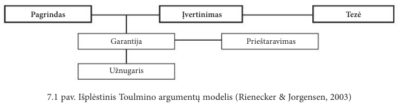

# Egzaminui „Mokslinių tyrimų ir inovacijų pagrindai“

## Mokslinis tyrimas

### Mokslinio tyrimo apibrėžimai

Tai tyrimas, atliekamas sisteminiais ir apgalvotais moksliniais metodais duomenims gauti, analizuoti ir aiškinti.

### Mokslinio tyrimo tikslas

Mokslinio tyrimo metu siekiama prisidėti prie mokslo sistemingai kuriant mokslo žinias apie tam tikrus realaus pasaulio reiškinius arba objektus.

### Apibrėžti mokslinio tyrimo teorinį ir empirinį lygmenis

* **Teorinis lygmuo** - siekiama plėtoti abstrakčias sąvokas apie pasirinktą reiškinį, šių sąvokų ryšius (t. y. kurti teorijas)
* **Empirinis lygmuo** - siekiama išbandyti teorines sąvokas ir ryšius, siekiant įsitikinti, ar jie atspindi stebėjimus tikrovėje. 

### Apibrėžti mokslinio tyrimo formą – indukciją

Tai samprotavimo procesas, apimantis perėjimą nuo specifinio prie bendrojo. 

Indukcinio tyrimo metu, tyrėjo tikslas yra iš stebėtų duomenų išvesti sąvokas ir modelius.

### Apibrėžti mokslinio tyrimo formą – dedukciją

Tai samprotavimo procesas, apimantis perėjimą nuo bendrojo prie specifinio.

Dedukcinio tyrimo metu, tyrėjo tikslas yra išbandyti savokas ir modelius, žinomus teorijoje.

### Kas yra mokslinės žinios?

Dėsnių ir teorijų apibendrinta visuma, įgyjama taikant mokslinį metodą, siekiant paaiškinti dominantį reiškinį arba elgesį.

### Mokslinio tyrimo ciklas

### Išvardyti mokslinių žinių išgavimo būdus ir mokėti trumpai juos paaiškinti

* Intuicija
  * Veiksmas arba procesas, nukreiptas į žinias ar tikrumą be samprotavimų arba išvadų darymo;
  * Paremta pateisinimais kaip "man atrodo teisinga", "aš tikiu";
  * 
  * Nėra mechanizmo atskirti tikslias ir netikslias žinias.
* Autoritetas
  * Kito asmens informacijos ar faktų priėmimas, nes asmuo yra gerbiamas šaltinis;
  * Asmens pateikiama informacija ar žinios gali būti netikslūs;
  * Naudojama norint įvertinti, ar keliama hipotezė yra patikrinama ir ar nagrinėjamas svarbus klausimas. 
* Racionalizmas
  * Žinios gaunamos naudojant samprotavimus ir daroma prielaida, jog pagrįstos žinios yra įgyjamos naudojant teisingą samprotavimo procesą;
  * Didžiausias racionalizmo trūkumų - du sąžiningi asmenys gali padaryti skirtingas išvadas;
  * Moksle samprotavimas naudojamas keliant hipotezes ar nustatant rezultatus, kurie parodytų hipotezių teisingumą ar klaidingumą.
* Empirizmas
  * Žinių įgyjimo būdas per patirtį;
  * Naudojant ***tik*** empirizmą, kyla pavojus - laikui bėgant gali pasikeisti požiūris į patirtį, įvykių atmintis nėra pastovi, žmonės pamištra, arba jų atsiminimai išsikraipo;
  * Norint naudoti empirizmą, tyrimai ir jų stebėjimai turi būti atliekami kontroliuojamomis sąlygomis, bandant sumažinti tyrėjų šališkumą ir padidinti objektyvumą.

## Inovacijos ir jas apibrėžiantys dokumentai

### Inovacijos apibrėžimas

Naujas arba patobulintas produktas ar procesas (ar jų derinys), kuris itin skiriasi nuo ankstesnių produktų ar procesų ir kuris yra prieinamas potencialiems naudotojams arba kuris yra naudojamas.

### Kas yra Fraskati vadovas, kas jame pateikiama?

Ekonominio bendradarbiavimo ir plėtros organizacijos (EBPO) ir nacionaliniais mokslinių tyrimų ir eksperimentinės plėtros (MTEP) ekspertų parengtas dokumentas - oficialusis standartinės praktikos mokslinių tyrimų ir eksperimentinės plėtros statistiniams tyrimams atlikti vadovas.

Vadove pateikti tarptautiniu mastu pripažinti MTEP apibrėžimai ir jų komponentų veiklos klasifikacijos.

### Kas yra Oslo vadovas, kas jame pateikiama?

Tai yra tarptautinis informacinis standartas, skirtas inovacijoms konceptualizuoti ir matuoti.

Jame pateikiamos mokslinės, technologinės ir inovacinės veiklos matavimo, duomenų apie inovacijas rinkitmo ir naudojimo gairės.

### Apibrėžti inovacijų rūšis: produktų ir verslo procesų inovacijas

* **Produkto inovacija** - nauja arba patobulinta prekė ar paslauga, kuri itin skiriasi nuo ankstesnių įmonės prekių ar paslaugų ir kuri yra pateikta rinkai.
* **Verslo proceso inovacija** - yra naujas arba patobulintas vienai ar kelioms verslo funkcijoms skirtas verslo procesas, kuris itin skiriasi nuo ankstesnių įmonės verslo procesų ir kurį įmonė naudoja.

### Kas yra MTEP ir jo apibrėžimas

Kūrybiškas ir sistemingas darbas, atliekamas plėsti turimas žinias, taip pat žinias apie žmoniją, kultūrą ir visuomenę, ir rasti naujų tokių žinių pritaikymo būdų.

### Kokias veiklos rūšis apima MTEP?

* Fundamentiniai tyrimai
  * Taikomoji/teorinė veikla vykdoma siekiant įgyti naujų žinių apie reiškinio esmę ir stebimus faktus;
  * pvz.: bendrųjų algoritmų, naudojamų dideliam duomenų kiekiui tvarkyti realiuoju laiku, savybių tyrimai.
* Taikomieji tyrimai
  * Originalus tyrimas atliekamas naujoms žinioms įgyti, nukreiptas į specifinių praktinių pasiekimą ar uždavinių įgyvendinimą.
  * pvz.: tyrimas, kuriuo siekiama rasti būdų mažinti brukalų (spam) srautą ir suprasti bendrą brukalų struktūrą ar verslo modelį, juos siunčiančių asmenų funkcijas ir motyvus.
* Eksperimentinė plėtra
  * Mokslinių tyrimų ir praktinės patirties pagrindu sukauptu pažinimu pagrįsta sisteminga veiklas, leidžianti įgyti papildomų žinių, tiesiogiai prisidenčių kuriant naujus produktus ar procesus, ar juos tobulinant;
  * pvz.: startuolis pasinaudoja tyrėjų sukurtu kodu ir parengia verslo planą, pritaikytą programų sistemos produktui, užtikrinančiam geresnę internetinę rinkodarą.

## Mokslinių tyrimų tipai ir tyrimo metodai

### Žinoti kuriai mokslo sričiai ir krypčiai priklauso jūsų studijų programa

> ❗ Reikia papildyti (mokslo sritis)

Informatikos inžinerijos kryptis.

### Apibrėžti ką reiškia pasakymas – mokslinis tyrimas pagrįstas metodologiškai

Metodologiškai pagrįstas mokslinis tyrimas turi būti:
  * Korektiškai suformuluota tema
  * Aptarta tyrimo koncepcija
  * Aptarta hipotezė
  * Parinkti ir aptarti tyrimo metodai

### Mokslinių tyrimų klasifikavimas pagal: taikomus metodus, tyrimo metodiką, keliamus tikslus, organizavimo tipą.

* Pagal tikslą
  * Žvalgomieji
    * Atliekami naujose srityje, tikintis išsiaiškinti proceso mastą, sukurti pirmines įdėjas arba patikrinti įvykdomumą;
  * Aprašomieji
    * Siekiama kuopščiai ištirti ir išsamiai aprašyti dominantį reiškinį. Šie stebėjimai turi būti pagrįsti moksliniu tyrimų metodu.
  * Aiškinamieji
    * Siekiama paaiškinti pastebėtus reiškinius, objektus arba procesus. Bandoma "sujungti taškus", nustatant reiškinio priežastinius veiksnius ir rezultatus.

### Kas yra trianguliacija? Kokie galimi trianguliacijos būdai?

Skirtingų metodų ar informacijos šaltinių derinimas, skirtas tik kokybiniams arba tik kiekybiniams duomenims rinkti bei analizuoti.

* Laiko atžvilgiu
* Vietos atžvilgiu
* Stebėtojų atžvilgiu
  * Tyrimas atliekamas kelių stebėtojų. Jei jų rezultatai sutampa, rezultatai yra pakankamai objektyvūs.
* Individualūs ir grupiniai
* Teorijų trianguliacija
  * Tiriama remiantis keliomis teorijomis

### Kuo skiriasi teoriniai ir empiriniai darbai?

Teoriniuose darbuose naudojamasi teorijomis, norint rasti racionalų atsakymą į rūpimą klausimą (dirbama deduktyviai).

Empiriniuose darbuose naudojamasi stebėjimais ir duomenimis, išeities taškas - realusis pasaulis (dirbama induktyviai).

### Kas yra teorija? Kas yra empirija?

* **Teorija** - tam tikros mokslo srities taisyklių sistema, apibūdinanti, aiškinanti ar prognozuojanti tos srities reiškinius ir padedanti tos srities suvokimo pagrindus.
* **Empirija** - medžiaga, kuri yra tyrimo objektas, kurą galima aprašyti (stebėjimai, duomenys ir pan.)

### Dedukcinių metodų veikimo principas

Teorija → Hipotezė → Stebėjimas → Patvirtinimas

### Indukcinių metodų veikimo principas

Stebėjimas → Modelis → Eksperimentinė hipotezė → Teorija

### Kas yra eksperimentas? Išvardykite eksperimentinio tyrimo etapus

Eksperimentas - empirinis tyrimas, skirtas planingai valdant proceso ar reiškinio sąlygas patikrinti hipotezes apie ryšį tarp priežastinių reiškinių. 

* Eksperimento eiga (pagal vadovėlį)
  * Apimties nustatymas
  * Planavimas
  * Eksperimento vykdymas
  * Duomenų analizė ir interpretavimas
  * Rezultatų pristatymas ir programinis realizavimas

* Eksperimento eiga (pagal skaidres)
  * Apsibrežiama tyrimo problema
  * Suformuluojama tyrimo hipotezė
  * Pasirenkamas poveikio būdas
  * Atsižvelgiama į populiaciją
  * Apgalvojama, kas gali iškreipti tyrimo rezultatus
  * Atliekami preliminarūs tyrimai
  * Laikomasi numatytų tyrimo procedūrų
  * Išanalizuojami eksperimento duomenys

### Kas yra hipotezė?

Preliminarus teiginys, kuris turi būti įrodytas arba paneigtas.

### Eksperimento kintamieji ir grupės

Eksperimente būna dviejų tipų kintamieji: nepriklausomi ir priklausomi. Eksperimento metu ***nepriklausomi*** kitamieji yra keičiami ir yra stebimas jų poveikis ***priklausomam*** kintamajam. Paprasčiau tariant - keičiami tyrimo įvesties kintamieji, stebima, kaip tai paveiks eksperimento išvestį.

Eksperimente galima išskirti dvi pagrindines, eksperimentinė ir kontrolinė, grupės. ***Eksperimentinei*** grupei yra taikomas tam tikri metodai, galimai keičiantys rezultatą, o ***kontrolinė*** grupė naudojama eksperimento gautų duomenų palyginimui.

### Eksperimentinių tyrimų rūšys: preliminarieji, skerspjūvio, longitudiniai, tikrieji eksperimentiniai tyrimai, kvazi-eksperimentiniai tyrimai

 * Preliminarusis tyrimas
 * Skerspjūvio tyrimas
   * Nustatoma požymių situacija tam tikru laiko ***momentu***
 * Longitudinis (ilgalaikis) tyrimas
   * Tyrimas, kurio metu reiškinys yra stebimas ir tiriamas ilgą laiką, naudojant tą pačią metodiką ir sąlygas.
 * Tikrasis eksperimentis tyrimas
   * Naudojamos eksperimentinės ir kontrolinės grupės, jos suburiamos atsitiktinai, grupių parametrai yra pilnai suvienodinti.
 * Kvazi-eksperimentinis tyrimas
   * Eksperimentas, kurio metu eksperimentinių ir kontrolinių grupių parametrai negali būti pilnai suvienodinti.

> ❗ Reikia papildyti (Preliminarusis tyrimas)

### Atvejo analizės (angl. case study) apibrėžimas

Empirinis tyrimas, kurio metu įtraukiami keli duomenų šaltiniai, siekiant ištirti vieną (arba nedidelį kiekį) atskirą atvejį, realiame kontekste, ypač kai riba tarp reiškinio ir konteksto negali būti aiškiai nustatyta.

### Atvejo analizės atlikimo etapai

* Atvejo (atvejų) identifikavimas ir ribų nustatymas
  * Apibrežiama kad yra laikoma *atveju*, nustatomos jo ribos
* Duomenų rinkimas
  * Renkama detali informacija, ji aprašoma naudojantis visais galimais šaltiniais.
* Duomenų analizė
  * Pateikiama išsamus atvejo aprašymas.
* Rezultatų interpretavimas
  * Pateikiamos tyrimo išvados, atskleisti nauji reiškinio aspektai.

## Argumentas, argumentavimas, argumentacija

### Kuo skiriasi argumentacija ir argumentavimas?

Argumentavimas - racionalus ir etiškas argumentų pateikimas, įrodinėjimas, skirtas savo įsitikinmams bei vertybėms pagrįsti ir daryti įtaką kitų žmonių mąstymui bei veiklai.

Argumentacija - teiginio teisingumo prgrindimo procedūra; teiginio pagrindimas, siekiant įtikinti jo teisingumu.

> ❗ Reikia papildyti (labai panašūs terminai)

### Mokslinio argumentavimo apibrėžimas;

Procesas, kurio metu mokslininkai, remdamiesi savo ar kitų moksliniais tyrimais, nustato kitų argumentų silpnybes ir apribojimus.

### Sudaryti Toulmino argumentų modelį ir mokėti paaiškinti kiekvieną jo elementą, t.y. kas yra pagrindas, tezė, įvertinimas, garantija, užnugaris ir prieštaravimas.

* Privalomos modelio dalys
  * Tezė;
  * Pagrindas;
  * Garantija.
* Neprivalomos modelio dalys
  * Prieštaravimas;
  * Užnugaris;
  * Įvertinimas.

* **Tezė** - nuomonė, kuriai autorius ieško pritarimo;
* **Pagrindas** - tezę pagrindžianti konkreti informacija;
* **Garantija** - tezę ir pagrindą siejantis bendras požiūris, kuris leidžia suformuluoti ir pagrįsti tezę.
* **Prieštaravimas** - Tai išlygos, kurios daromos dėl garantijos teisingumo, kai bendrasis garantijos autoritetas neveikia;
* **Užnugaris** - dokumentas nurodantis kodėl reikia tikėti bendrąja garantijos reiškiama taisykle.
* **Įvertinimas** - apibendrinimas, kuriama pateikiama, kaip tezės teisingumu yra įsitikinęs siuntėjas ir kiek jis už ją garantuoja.

## Mokslinio tyrimo etika

### Etikos apibrėžimas

Atitiktis tam tikros profesijos ar grupės elgesio standartams.

### Kokie etiniai principai yra nusistovėję mokslo bendruomenėje? Mokėti paaiškinti kiekvieną iš jų

* Savanoriškas dalyvavimas ir nekenksmingumas
  * Tyrimo dalyviai tyrime dalyvauja savo noru ir gali iš jo bet kada pasitraukti.
* Anonimiškuams ir konfidencialumas
  * Yra saugomas tyrimo dalyvių anonimiškumas ir konfidencialumas - iš tyrimo rezultatų negali būti įmanoma įdentifikuoti tam tikrų asmenų.
* Atskleidimas
  * Įprastai, tyrimo dalyviams turi būti atskleidžiama informacija apie tyrimą, prieš jam sutinkant jame dalyvauti. Jei to padaryti negalima (atskleidimas pakentų tyrimo rezultams), ši informacija turi būti atskleidžiama iškart gavus reikiamus rezultatus.
* Analizė ir ataskaitos
  * Netikėtos ir neigiamos išvados turėtų būti visiškai atskleistos, net jei kelia abejonių dėl tyrimo projekto ar išvadų.

### Apibrėžkite empirinio tyrimo etinius principus

* Tyrimo dalyviai turi duoti informuoto asmenst sutikimą dalyvauti tyrime.
* Mokslinis tyrimas turi turėti mokslinę vertę.
* Tyrėjai turi imtis visų įmanomų priemonių siekiant užtikrinti neskelbtinos informacijos konfidencialumą.
* Atliekamo tyrimo nauda turi viršyti tyrimo metu patiriamą rizikos ar žalos dydį.

### Ką apibrėžia mokslininko etikos kodeksas?

Nusako svarbiausius mokslininko elgsenos bendrąsias nuostatas ir normas.

## Plagijavimas:

### Apibrėžkite kas yra plagiatas

Atradimo, išradimo, mokslo, meno, literatūros veikalo ar jo dalies autorystės pasisavinimas ir paskelbimas savo vardu ar slapyvardžiu, pasinaudojimas be autoriaus leidimo.

### Kuo skiriasi idėjos ir teksto plagiatas?

* **Idėjos plagijavimas** - idėjos pasisavinimas visiškai, arba iš dalies, su paviršutiniškomis modifikacijomis, nepripažįstant jos sumanytojo.
* **Teksto plagijavimas** - tai teksto iš kito šalitnio kopijavimas, nepripažįstant jo autoriaus ir jo necituojant.

### Paaiškinkite ką reiškia savęs plagijavimas

Autorius naujame darbe naudoja/kopijuoja savo anksčiau paraštą darbą ar duomenis naujame darbe, nepranešdamas skaitytojui, kad ši medžiaga jau yra publikuota kitur.

### Pateikite plagijavimo vengimo rekomendacijas (12 punktų)

1. **Koncepcija** - sukurkite originalią hipotezę;
2. **Mokslinio tyrimo projektavimas** - iš anksto pasiruoškite, suplanuokite ir pagrįskite mokslinius tyrimus;
3. **Kruopšti literatūros paieška**
4. **Pradėkite rašyti rankraštį** - atlikus paiešką ir tyrimus, pradėkite rašyti savo židžiais, nežiūrėdami į kitus šaltinius.
5. **Griežtai laikykitės mokslinio darbo struktūros**
6. Jei reikia kopijuoti:
   1. Tekstą pateikite kabutėse, pacituokite šaltinį;
   2. Aprašykite visus informacijos šaltinius;
   3. Padekokite;
   4. Pateikite išnašas.
7. Jei reikia kopijuoti savo tekstą iš anksčiau paskelbto straipsnio, reikia gauti leidėjo sutikimą;
8. Jeigu norite naudoti paveikslus / lenteles / iliustracijas:
   1. turi būti gautas autorių sutikimas;
   2. turi būti nurodytas tiesioginis šaltinis;
   3. kai kurie paveikslai turi leidimą būti kopijuojami.
9. **Dubliavimas** - venkite vienu metu rašyti panašius straipsnius ir pateikti juos įvairiems žurnalams;
10. **Naudokite automatinio plagijavimo aptikimo įrankius**
11. **Segmentavimo prevencija** - ankstesnės publikacijos turi būti nurodytos vėlesnėse susijusiose publikacijose.
12. **Autorių teisės** - būtinai susipažinkite su pagrindiniais autorių teisių įstatymo elementais.

## Modeliavimas ir simuliacija

### Apibrėžkite kas yra modelis

Aiškiai nusakytą tikslinę paskirtį turintis supaprastintas sistemos, proceso, reiškinio ar kokio nors kito originalo analogas, tapatus tam originalui modeliavimo tikslų požiūriu.

### Kuo skiriasi modeliavimas ir simuliacija?

Modeliavimas yra modelio kūrimas, simuliacija - to modelio vykdymas laiko tėkmėje.

### Kuo koncepcinis modelis skiriasi nuo simuliacinio modelio?

> ❗ Reikia papildyti

### Kokie yra modelių tipai?

> ❗ Reikia papildyti

### Pagal ką modeliai skirstomi į tipus?

* Pagal kintamųjų tipą
  * **Deterministiniai** - įeigos ir išeigos kintamieji yra fiksuoti;
  * **Stochastinius** - kai bent vienas įeigos arba išeigos kintamasis yra tikimybinis.
* Pagal laiko sąvoką
  * **Statiniai** - kai laiko aspektas nėra svarbus;
  * **Dinaminiai** - kai atsižvelgiama į kintamųjų ir laiko sąveiką.

### Kokie yra pagrindiniai modeliavimo ir simuliacijos trūkumai?

* Nepakankamas išsamumas
  * Modelyje neįmanoma atvaizduoti visų realaus fenomeno savybių;
* Aproksimacijos
  * Apytiksliai duomenys naudojami modeliuose nėra tikslūs, todėl gaunamos progrnozės gali skirtis nuo realybės;
* Nepankamas tikslumas
  * Modeliai supaprastinami, prarandamas tikslumas
* Neaiškus rezultatų interpretavimas

### Kokie yra pagrindiniai modeliavimo ir simuliacijos žingsniai?

### Ką reiškia pakankamai tikslus simuliacinis modelis?

> ❗ Reikia papildyti

### Kas yra simuliacinio modelio validavimas ir verifikavimas?

* **Verifikavimas** - klaidų identifikavimas ir pašalinimas iš simuliacinio modelio, lyginant su realaus pasaulio rezultatais.
* **Validavimas** - užtikrinimas, kad simuliacinis modelis yra naudingas realaus pasaulio problemai spręsti.

### Kokie yra simuliacinio modelio validavimo būdai?

* Subjektyvus vertinimas
  * Modelis tikrinamas jį kūrusios komandos
* Nepriklausomas vertinimas
  * Modelis tikrinamas trečios, nepriklausomos šalies
* Bendras vertinimas
  * Į modelio vertinimą įtraukiami ir būsimi modelio vartotojai
* Kriterinis vertinimas
  * Modelio įvertinimui yra naudojami kriterijai

### Ką reiškia patikimi duomenys simuliacijos kontekste?

> ❗ Reikia papildyti

### Kokie yra simuliacinio modelio verifikavimo būdai? 

* Statinis testavimas
  * Modelis yra analizuojamas naudojant metodus kaip struktūrinis perėjimas, teisingumo įrodymas ir stuktūrinių savybių nagrinėjimas sukurtame modelye.
* Dinaminis testavimas
  * Modelis yra vykdomas esant skirtingoms sąlygoms, gauti rezultatai naudojami nustatyti, ar modelis įgyvendintas teisingai.

### Kokie verslo proceso modeliavimo elementai apibūdina verslo proceso aspektus?

* Elgesio aspektas
  * Apibrėžia proceso valdymo srautą kaip veiklų seką.
* Funkcinis aspektas
  * Nurodo veiklas, kurios gali būti vykdomos verslo procese, tačiau šios veiklos nėra išsamiai apibrėžiamos.
* Informacinis aspektas
  * Apibrėžia duomenų objektus, naudojamas saugojimo vietas, duomenis, kurie yra įeigos ir išeigos.
* Organizacinis aspektas
  * Apibūdina resursus, vykdančius veiklas arba jose dalyvaujančius.

### Koks yra simuliacijos vaidmuo moksliniuose tyrimuose?

Pagal P. Axelrod yra septyni simuliacijos vaidmenys moksliniuose tyrimuose:

* Prognozavimas
* Vykdymas
* Mokymas
* Pramoga
* Švietimas
* Įrodymui
* Teorijos atradimui

### Kaip vyksta simuliacija grindžiamas teorijos kūrimas?

