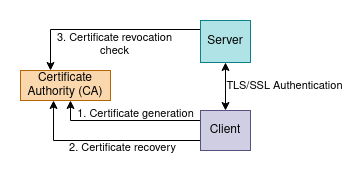
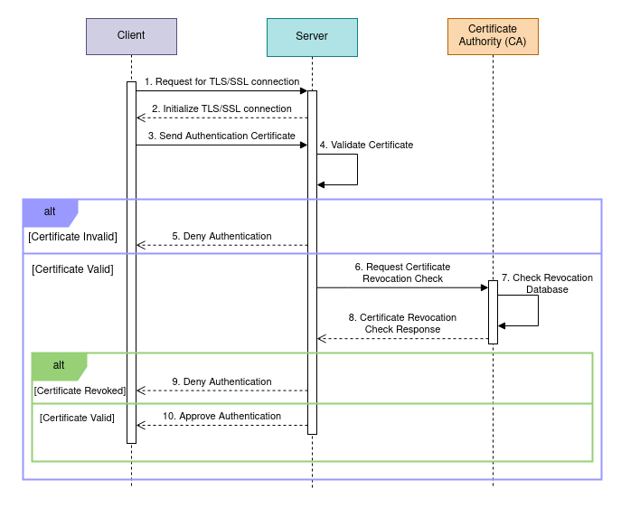

# Core Communication



## CA
All communication with the CA is performed via REST API.

### 1. POST /generate 
Request body:
```
{
    "subject": "string"
}
```
`subject` - name for whom the certificate is generated
Response body:
```
{
	"cert_pem": "string",
	"cert_recovery": "string"
}
```
`cert_pem` - generated certificate in PEM format
`cert_recovery` - key for recovering a lost certificate


### 2. POST /recover
Request body:
```
{
    "subject": "string",
    "key": "string"
}
```
`subject` - name for whom the certificate is generated
`key` - key for recovering a lost certificate
Response body:
```
{
	"cert_pem": "string",
	"cert_recovery": "string"
}
```
`cert_pem` - generated certificate in PEM format
`cert_recovery` - key for recovering a lost certificate


### 3. POST /revoked
Request body:
```
{
    "certificate": "string",
}
```
`certificate` - certificate in PEM format
Response body:
```
{
	"revoked": "bool",
}
```
`revoked` - whether the certificate has already been revoked


# Authentication

